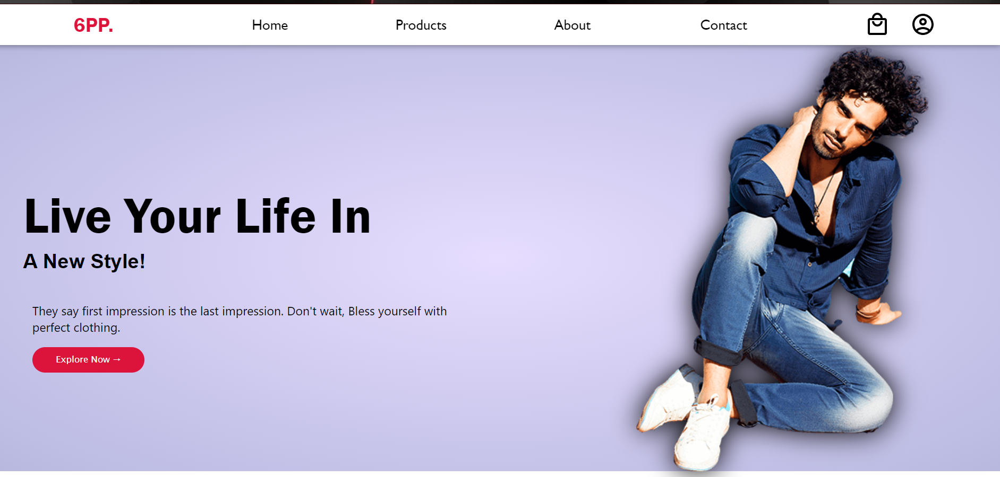
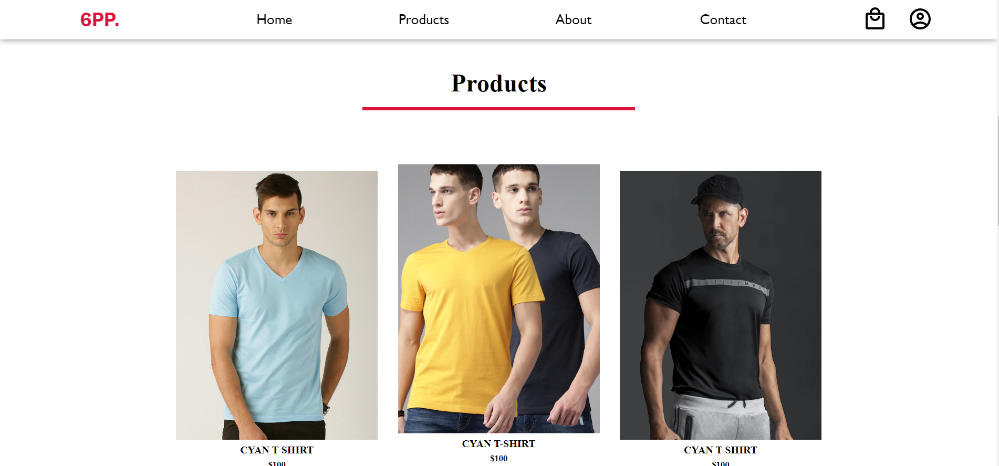

# flexbox-tutorial
This is an Ecommerce Website. This project has been made to learn HTML and CSS.

Flexbox feature of CSS has been used here extensively to learn.

# Ecommerce Website 




Welcome to my Ecommerce Website! This project is a single-page application built for learning purposes using HTML and CSS. The application simulates an ecommerce website, where users can browse products, add items to their cart, and proceed with a checkout process. Please note that this is not a fully functional production-ready website but rather a learning project.Flexbox feature of CSS has been used here extensively to learn.

## Table of Contents

- [Demo](#demo)
- [Features](#features)
- [Installation](#installation)
- [Usage](#usage)
- [Technologies Used](#technologies-used)
- [Contributing](#contributing)

## Demo

You can check out the live demo of the Ecommerce Website at [https://www.ecommerce-demo.com](https://www.ecommerce-demo.com).

## Features

- User-friendly interface with a clean and responsive design.
- Browse and view product listings with details and images.
- Add products to the shopping cart and adjust quantities.
- Simulated checkout process for learning purposes.

## Installation

To run this Ecommerce Website locally on your machine, follow these steps:

1. Clone the repository to your local machine:

```bash
git clone https://github.com/your-username/ecommerce-website.git
cd ecommerce-website
```

2. Open the `index.html` file in your preferred web browser to run the application.

## Usage

1. Upon opening the application in your web browser, you will be presented with the home page, showcasing available products.

2. Browse through the product listings and click on individual items to view more details.

3. To add a product to your shopping cart, click the "Add to Cart" button on the product page.

4. Access the shopping cart by clicking on the cart icon in the header. From the cart, you can adjust quantities, remove items, and proceed with the simulated checkout process.

5. Please note that this is a learning project and does not have actual payment processing capabilities.

## Technologies Used

The Ecommerce Website is built using the following technologies:

- HTML: The markup language used to structure the content.
- CSS: The style sheet language used for presentation.
- JavaScript: The programming language for interactive functionalities.

## Contributing

Thank you for considering contributing to this learning project! If you have any suggestions, improvements, or bug fixes, please feel free to raise an issue or submit a pull request.


Thank you for exploring my Ecommerce Website! I hope you find it helpful for learning web development concepts. If you have any questions or would like to get in touch, please feel free to contact me at [seth.aryan605@gmail.com](mailto:seth.aryan605@gmail.com). Happy coding!

